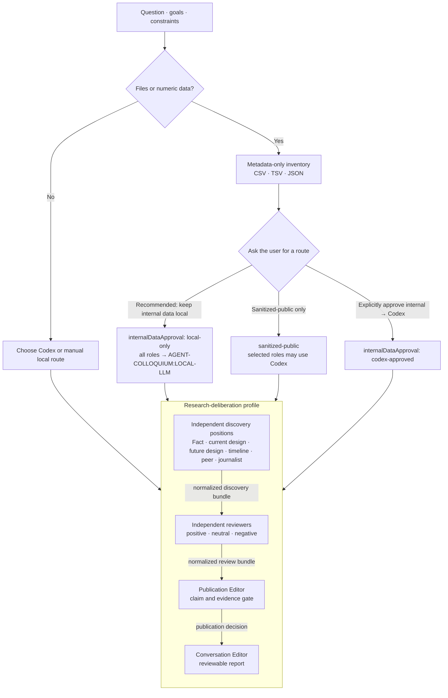

# Agent Colloquium

> A structured multi-agent deliberation workflow for scientific research, experimental planning, and technical decisions.

**Agent Colloquium** is a Codex-first, open-source research workflow for turning an early idea into a reviewable decision. It separates independent viewpoints from later review so a conclusion retains evidence gaps, counterarguments, and unresolved disagreement.

> **Status:** early implementation. This repository ships an installable Codex skill, a deterministic mock TypeScript engine for protocol checks, and editable profiles. It is not yet a provider-independent production runner.

## Who this is for

- Researchers and graduate students evaluating experimental ideas.
- Engineers planning technical work under uncertainty.
- Teams that want AI-assisted decisions with visible assumptions and evidence boundaries.

## What it helps with

- Scientific research questions and hypothesis evaluation.
- Experimental planning and process-window analysis.
- Multi-agent deliberation and structured technical review.
- Preserving disagreement before a final recommendation.
- Separating plausible ideas from verified evidence and approved actions.

## Beyond coding: research work with agentic tools

This project treats Codex as more than a coding assistant: it is a workspace for structured research reasoning. As agentic tools such as Codex and Claude expand into broader knowledge-work workflows, researchers need an interaction model that makes assumptions, evidence gaps, disagreement, and approval boundaries visible instead of hiding them inside a single persuasive answer.

Agent Colloquium is designed to provide that usability layer. It helps a researcher turn an early idea into a reviewable record without confusing an answer, a citation, or a plausible plan with verified research or permission to act.

## How a deliberation works

The workflow asks for a question, goals, and constraints. If files or numeric data are present, it makes the data-routing decision **before** any role sees the material. The research profile then keeps early roles independent, gives every reviewer the same normalized discovery bundle, and makes the Publication Editor a real gate before the final report.



The generic flow uses four independent positions—Domain Analyst, Evidence Reviewer, Feasibility Reviewer, and Contrarian—followed by cross-examination and a fresh synthesis context. It does not claim to have run the research profile.

## Profiles

A **profile** is an editable operating guide for a particular kind of deliberation. It defines:

- the roles and the question each role is responsible for;
- the input boundary for each role, including what it must not receive;
- stage order and permitted handoffs;
- data-routing policy and output standards; and
- the matching artifact contract that makes the workflow reviewable.

| Profile | Best for | Flow |
| --- | --- | --- |
| Generic (built in) | Product, technical, or general decisions | Four independent positions → cross-examination → fresh synthesis |
| [`research-deliberation`](plugins/agent-colloquium/profiles/research-deliberation/PROFILE.md) | Research hypotheses, experimental plans, and paper positioning | Independent discovery → independent review → Publication Editor → Conversation Editor |

The research profile is deliberately editable. Change role wording or scope in [`PROFILE.md`](plugins/agent-colloquium/profiles/research-deliberation/PROFILE.md), then keep [`src/profile/`](src/profile/) and the staged artifact validation aligned. A profile edit changes behavior; run the profile tests before relying on it.

### Research profile stages

1. **Discovery:** Fact Investigator, Current Experiment Designer, Future Experiment Designer, Timeline Planner, Peer Researcher, and Science Journalist work independently. The conditional Blind Internal Data Analyst receives decontextualized numbers only.
2. **Review:** Positive, Neutral, and Negative Reviewers independently assess the same normalized discovery bundle; they do not see one another's first-pass output.
3. **Publication gate:** The Publication Editor decides the strongest defensible claim, evidence threshold, novelty/reproducibility risks, and status (`survives`, `needs-evidence`, `deferred`, or `pruned`).
4. **Editorial output:** The Conversation Editor turns the publication decision, normalized positions, and preserved disagreement into a readable report.

## Data routing and manual local models

Data routing is a user decision, not an automatic assumption. The safe intake currently accepts **CSV, TSV, and JSON** and returns only filename, format, bytes, row count, and column names. It does not print values. Excel, PDF, image, and arbitrary binary files are intentionally unsupported.

For internal data, the skill asks for an explicit choice and recommends the local route:

| User choice | Required record | Effect |
| --- | --- | --- |
| Keep internal data local (recommended) | `dataClassification: "internal"`, `internalDataApproval: "local-only"` | Every role uses `AGENT-COLLOQUIUM:LOCAL-LLM`. |
| Send sanitized-public data to Codex | `dataClassification: "sanitized-public"`, `internalDataApproval: "not-applicable"` | Individual roles may use Codex. |
| Send internal data to Codex | `dataClassification: "internal"`, `internalDataApproval: "codex-approved"` | Allowed only after explicit user confirmation. |

`codex-approved` is never inferred from a target setting. Without it, an internal route that resolves to Codex is rejected.

Create an editable route policy:

```bash
mkdir -p .agent-colloquium
cp plugins/agent-colloquium/profiles/research-deliberation/execution-targets.example.json \
  .agent-colloquium/execution-targets.json
```

The recommended internal-data policy is:

```json
{
  "dataClassification": "internal",
  "internalDataApproval": "local-only",
  "defaultTarget": "AGENT-COLLOQUIUM:LOCAL-LLM",
  "roleTargets": {}
}
```

Inspect one or more files without printing values:

```bash
pnpm --silent colloquium:inspect-data -- \
  --targets .agent-colloquium/execution-targets.json \
  --file path/to/data.csv
```

[`LOCAL-LLM.md`](plugins/agent-colloquium/profiles/research-deliberation/LOCAL-LLM.md) describes the optional local-model label. It is manual-export only: this release validates configuration but does not open an endpoint, invoke a provider SDK, or run a local model.

## Use it in Codex

This repository is its own private GitHub marketplace:

```bash
codex plugin marketplace add https://github.com/scorchedrice/agent-colloquium
codex plugin install agent-colloquium@agent-colloquium
```

This is not an official marketplace listing. The repository does not publish, update, or submit anything on a user's behalf.

Then invoke the installable [`agent-colloquium` skill](plugins/agent-colloquium/skills/agent-colloquium/SKILL.md) as `$agent-colloquium` and supply all three intake fields: `question`, `goals`, and `constraints`.

```text
question: A heat treatment changes mobility and bias-stress stability in amorphous IGZO out of sync. Is a local-structure hypothesis worth testing?

goals:
- Decide whether the hypothesis is experimentally defensible.
- Identify the smallest discriminating experiment.

constraints:
- PLD, TEM, XRD, and AFM are available.
- No equipment control or external action is authorized.
```

The protocol writes only `artifact.json` and `report.md` under `.agent-runs/agent-colloquium/<run-id>/`. It does not control equipment, upload data, publish, or send messages.

## Repository map

| Path | Responsibility |
| --- | --- |
| [`plugins/agent-colloquium/`](plugins/agent-colloquium/) | Installable Codex plugin, skill, editable profiles, and protocol reference. |
| [`src/`](src/) | TypeScript mock engine, artifact validation, data inventory, and route contracts. |
| [`test/`](test/) | Product behavior and public-documentation checks. |
| [`fixtures/`](fixtures/) | Safe inputs for deterministic tests and walkthroughs. |

## Verify the public product

```bash
pnpm install
pnpm verify
```

`pnpm verify` runs TypeScript and product tests. It does not publish a package, push a branch, call a provider, or make an external change.

## Current boundary

The product goal is a host-independent TypeScript multi-agent deliberation engine. The current public implementation is Codex-first. Claude Code, Gemini, Hermes, provider adapters, automated local-LLM transport, equipment integration, and deployment are future work—not behavior implied by this repository today.
